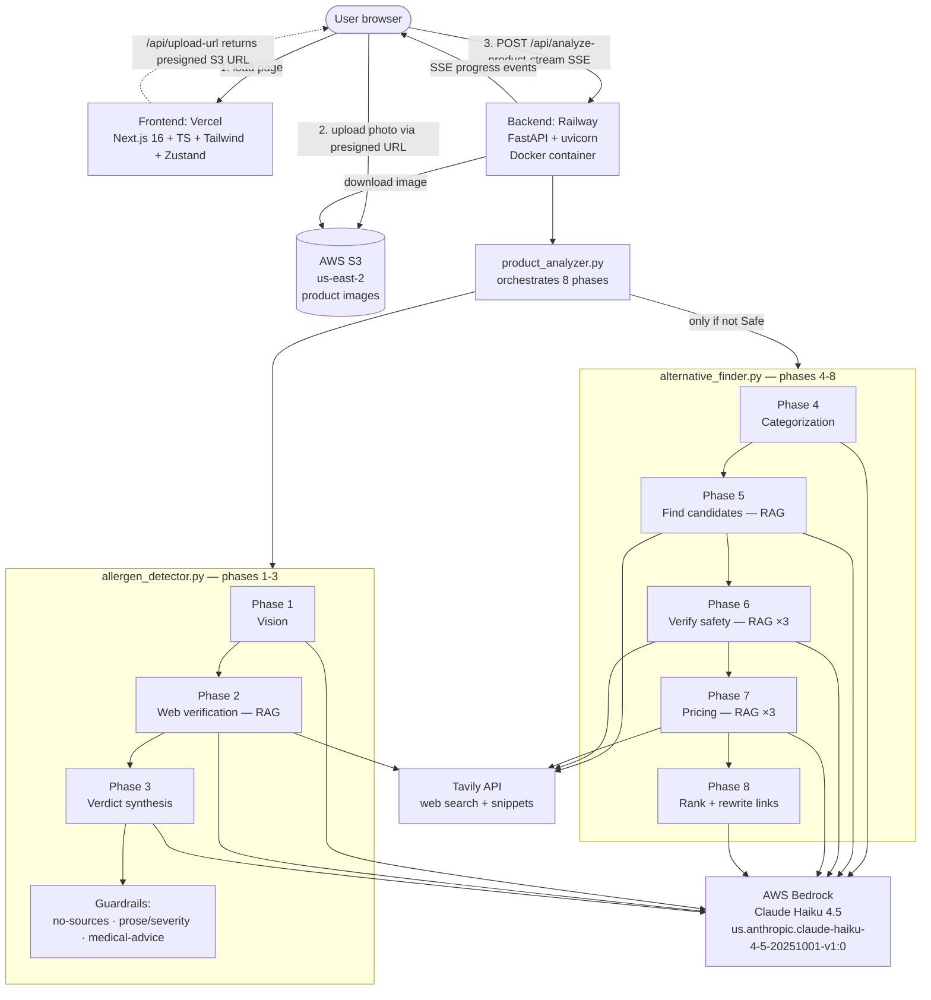

# AllerSafe Architecture

End-to-end description of how the system is built and how data flows through it.

## System diagram

## The three tiers

**Client tier — user's browser.** Loads a Next.js SPA from Vercel. In-memory state via Zustand. No user accounts, no auth.

**Static frontend — Vercel.** Serves Next.js pages. Also runs one tiny serverless function (`/api/upload-url`) that generates an S3 presigned URL, so the browser uploads photos to S3 directly rather than through the backend. Keeps 5MB image payloads out of the Railway container.

**Image storage — AWS S3.** Bucket in `us-east-2`. Uploads land as `images/{uuid}.{ext}`. Backend later downloads server-side using the same AWS creds.

**Backend — Railway.** Single Docker container running FastAPI + uvicorn. Public URL `allersafe-production.up.railway.app`. Auto-deploys from GitHub `main`. Binds to `$PORT` (Railway injects 8080).

**LLM tier — Bedrock.** Single model — Claude Haiku 4.5 — invoked via LiteLLM. Every phase uses the same model; the differentiation between phases is prompts and whether Tavily results are included.

**Retrieval tier — Tavily.** Called explicitly from 4 of the 8 phases (2, 5, 6, 7). Each phase constructs its own query. Results are text-injected into the prompt before Bedrock is called. Classic RAG.

## The 8-phase pipeline

| # | Phase | LLM | RAG? | What it does |
|---|-------|-----|------|--------------|
| 1 | Image analysis | Bedrock (vision) | No | Reads product label, extracts name/brand/visible ingredients |
| 2 | Web verification | Bedrock | **Yes** — Tavily × 1 | Fetches real ingredient list with cited sources |
| 3 | Allergen synthesis | Bedrock | No | Produces final `severity` verdict; 3 guardrails run |
| 4 | Categorization | Bedrock | No | Category + search terms for alternatives |
| 5 | Find candidates | Bedrock | **Yes** — Tavily × 1 | Proposes 5-10 alternative products |
| 6 | Verify safety | Bedrock | **Yes** — Tavily × 3 | Per-candidate ingredient check; excludes dangerous |
| 7 | Pricing & availability | Bedrock | **Yes** — Tavily × 3 | Per-candidate price/store lookup |
| 8 | Final ranking | Bedrock | No | Top-5 list; rewrites purchase_links to search URLs |

Total per full scan: ~15-25 seconds, ~8 Tavily calls, ~$0.04-0.06 cost.

## Data flow — chronological trace of one scan

1. User taps **Analyze** in the frontend.
2. Frontend requests a presigned S3 URL from Vercel's `/api/upload-url`.
3. Browser `PUT`s the image directly to S3.
4. Frontend `POST`s `{s3_image_url, allergens}` to Railway — opening an SSE connection.
5. Railway downloads the image from S3 into a temp file.
6. **Phase 1**: base64-encode, send to Bedrock with vision prompt. `Phase1Output` Pydantic model validates.
7. Progress event streamed to browser.
8. **Phase 2 (RAG)**: build a Tavily query like `"{product_name} ingredients allergens"`. Fetch top 5 results. Inject snippets into prompt. Send to Bedrock. `Phase2Output` validates.
9. Progress event.
10. **Phase 3**: reasoning phase. No retrieval. Prompt contains phase 1 + 2 outputs. Claude produces `severity`, `allergens_detected`, `warnings`. `Phase3Output` validates.
11. **Three guardrails run** on phase 3 output:
    - Safe with no sources → downgrade to Caution.
    - Prose mentions a user allergen but severity is Safe → downgrade.
    - Any medical-advice phrase in warnings → prepend disclaimer.
12. If verdict is anything other than Safe and alternatives were requested, alternative finder starts.
13. **Phase 4**: reasoning, no retrieval. Categorize product, generate search terms.
14. **Phase 5 (RAG)**: Tavily search with phase 4's terms. Claude proposes candidates.
15. **Phase 6 (RAG × 3)**: for the top 3 candidates, run one Tavily search per candidate. Claude verifies each; excludes any with user's allergens.
16. **Phase 7 (RAG × 3)**: same pattern for pricing.
17. **Phase 8**: reasoning. Rank the surviving candidates. Post-processing rewrites `purchase_links` to reliable search URLs and strips hallucinated `image_url` fields.
18. Final event streamed with the complete result.

## Cross-cutting concerns

**Configuration** — env vars in Railway (`TAVILY_API_KEY`, `AWS_*`) and Vercel (`NEXT_PUBLIC_API_URL`). Local `.env` gitignored.

**Auth** — none. No user accounts. IAM creds on backend grant S3 + Bedrock access.

**Validation** — Pydantic schemas (`backend/schemas.py`) at every phase boundary. Malformed LLM output → structured `ValidationError` → safe Caution fallback.

**Observability** — stdout logging captured by Railway (`npx @railway/cli logs`). Vercel Analytics on the frontend. No structured tracing, no metrics dashboard, no alerts.

**Error handling** — each phase has a fallback path. Pipeline degrades to `severity: "Caution"` with an explanation rather than returning 500s.

**Deployment** — GitHub `main` push → Vercel builds Next.js and deploys → Railway builds Dockerfile and deploys. No automated test gating.

**Cost profile** — Vercel: free tier. Railway: ~$5-10/month. Tavily: free tier ~125 scans/mo. Bedrock: pay-per-token, negligible for demo traffic. S3: cents/month.

## Architectural decisions worth defending

1. **Provider-agnostic LLM layer via LiteLLM.** One call shape across all 8 phases. Migration from Gemini/OpenRouter to Claude/Bedrock was a one-line-per-call change. Optionality baked in.

2. **RAG pipeline instead of an agentic loop.** Deterministic phase ordering. Predictability > flexibility for a safety-critical medical-adjacent app. Bounded cost (~8 Tavily calls, not "up to 50"). Easier to test and debug per-phase.

3. **Layered defense against false negatives.** Three post-hoc guardrails that can only *downgrade* severity, never upgrade. Combined with Pydantic schema enforcement, combined with the "no Safe without sources" retrieval requirement. Monotonic downgrades — the system can be over-cautious but never falsely reassuring.

4. **Direct browser → S3 uploads via presigned URLs.** Backend doesn't buffer images. Small perf win now, meaningful cost/latency win at scale.

5. **One IAM credential for both S3 and Bedrock.** Aligned with the "same region" (`us-east-2`) choice. Minimal cross-region latency, one policy to manage.

## Known weaknesses

1. **No test gating on deploy.** Push to main → deploy. Eval suite exists in `backend/evaluation/` but doesn't run in CI. Natural next investment.

2. **Single point of failure at each service.** No redundancy on Railway, no fallback if Bedrock is down, no cache on Tavily. Acceptable for a portfolio/demo, not for a real product.

3. **Not agentic.** If a user uploads unpackaged fruit, all 8 phases run wastefully before phase 1 detects `is_product: false`. An agent would notice earlier and skip work. Deliberate trade-off: agent designs have their own failure modes and are much harder to reason about in a safety-critical domain.

4. **`image_url` hallucination handled by stripping.** Cleaner solution would be to hook up a real product-image search API (Bing Image Search, Google Custom Search) and rewrite to guaranteed-resolvable URLs — same pattern as the `purchase_links` rewrite. Not urgent since the frontend already ignores the field.

5. **Semantic wrongness of sources not detected.** If Tavily returns URLs about a different product with the same name, we accept them as authoritative. Real fix would be an LLM-as-judge verifier or private ingredient databases with SLAs.

## Related documentation

- [Backend API and deploy details](../backend/README.md)
- [Frontend structure and dev workflow](../allersafe/README.md)
- [Evaluation framework](../backend/evaluation/README.md)
- [Root project overview](../README.md)
